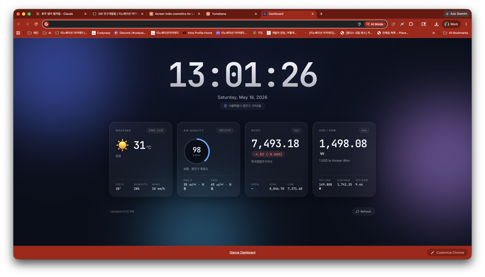

# Glance Dashboard

A minimal Chrome new-tab dashboard for Korea. Replaces the default new-tab page with four glanceable cards: weather, air quality, KOSPI, and USD/KRW.



## Cards

| Card | Source | Notes |
|------|--------|-------|
| **Weather** | KMA 기상청 (via `weather.naver.com`) | Temperature, "feels like", humidity, wind |
| **Air Quality** | AirKorea 에어코리아 KHAI (via `weather.naver.com`) | KHAI index + PM2.5 / PM10, ring color follows the Korean 4-tier grade (좋음 · 보통 · 나쁨 · 매우나쁨) |
| **KOSPI** | Yahoo Finance (`^KS11`) | Last price, change, day open / high / low |
| **USD / KRW** | [open.er-api.com](https://open.er-api.com) | Plus 100 USD, EUR/KRW and JPY/KRW cross-rates |

No API keys. Data auto-refreshes every 5 minutes and pauses when the tab is hidden.

## Install (Load unpacked)

1. Clone or download this repo.
2. Open `chrome://extensions` in Chrome.
3. Toggle **Developer mode** (top-right).
4. Click **Load unpacked** and select the project folder.
5. Open a new tab.

Allow the location prompt for an accurate region match. If you deny it, the weather and air cards fall back to Naver's IP-based default location.

## How it works

The weather and air-quality cards share a single fetch of `weather.naver.com/today/{regionCode}` and parse the embedded `blockApiResult` JSON. The region is resolved from `navigator.geolocation` → Nominatim reverse geocode (Korean) → Naver's `searchRegion` endpoint, then cached in `localStorage` keyed by coordinates rounded to ~100 m.

KOSPI uses Yahoo Finance's v8 chart endpoint; FX uses the free `open.er-api.com` USD-base feed and cross-rates the other currencies through USD.

All cross-origin hosts are declared in `manifest.json` under `host_permissions` — adding a new data source requires extending that list.

## Files

```
manifest.json     Chrome MV3 manifest (overrides newtab)
newtab.html       Markup for the dashboard
styles.css        Layout + the aurora background + AQI ring
app.js            All data fetching, parsing, and DOM updates
build_icons.py    Regenerates icons/icon{16,48,128}.png (stdlib only)
icons/            Extension icons
```

## License

MIT
